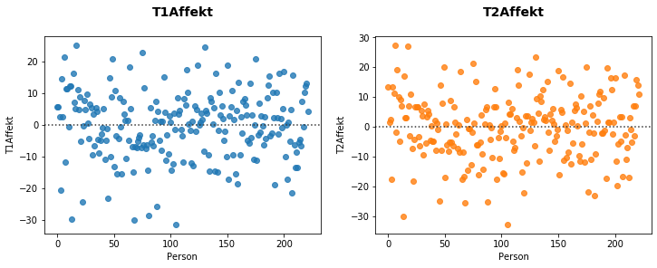

# Affective response to generic masculine in men and women

In this notebook data is analyzed using two-way repeated measurements ANOVA with pingouin. The data was collected by experimental variation of a text and measuring of the impact on affective response, presenting two groups of participants either a text written in generic masculine or gender neutral (condition 1). Affective response was measured before and after presentation of the text (T1/T2). Furthermore, the affective impact was examined separately for men and women (condition 2). 
Thus, the data analysis is designed as a 2x2 repeated measurements ANOVA using the Pingouin library.

*Possible main effects:*
+ Text variant (generic masculine/gender neutral) → Affective response (T1/T2)
+ Gender → Affective response (T1/T2)

*Possible interaction effects:*
+ Gender → Text variant (generic masculine/gender neutral)

*In case of significant interaction effects, post hoc tests can be applied to:*
+ Generic masculine/male → gender neutral/male
+ Generic masculine/female → gender neutral/female
+ Generic masculine/male → generic masculine/female
+ Gender neutral/male → gender neutral/female

The collected data consists of 222 observations. Thereof 167 female and 55 male participants, who were randomly assigned to one of the two text conditions.

## TL; DR
For both possible main effects there is no significant result. Neither is for interactions. The data hints towards an interaction, indicating that men and women respond with increased/reduced affective responses respectively. The lack of a significant result can be associated to the small sample sizes (especially for men where N=16 for control and N=39 for experimental group) due to the division by 4 of the original sample size in the 2x2 ANOVA design.

Further studies should include larger sample sizes, as there might be an interesting interaction effect for gender response to texts in generic masculine form.

## Data analysis

*Let's take a look at the dataset:*

*First, boxplots of the data give a good idea about its distribution and possible effects:*

The data is spread quite widely and there is no obvious effect visible.

In order to be able to apply ANOVA, we have to check on some preconditions.
*First, homoscedasticity and independence of residuals:*

The residuals are spread asymmetrically. Therefore, we can infer heteroscedasticity and independence of residuals.
*Next, let's check on equal variances of the subgroups:*

All of the levene tests are insignificant. The unbalanced group sizes can therefore be ignored and ANOVA can be applied.

*Before getting hard facts through the ANOVA, the differences in T1-/T2-affective response for the two conditions give an idea of possible interactions:*

Looks like we can expect an interaction to show up!
Men's affective response seems to go up whereas it drops for women.

*Now, let's finally apply the two-way repeated measures ANOVA:*

For both possible main effects there is no significant result. The most interesting result in ANOVA mostly is the interaction. Here, there is no significant effect, too. The plot above indicates that there might be an interesting interaction though. The limited group size (especially for men (N=16 for control and N=39 for experimental group)) does not allow for an effect to show up. Even for balanced group sizes, the original sample of N=222 would effectively be divided by 4 in a 2x2 design like this one.
The wide-spread boxplots above give an indication of how the data is overlapping.

As there are no significant main effects or interactions, post-hoc tests will not be performed.

Further studies should include larger sample sizes, as there might be an interesting interaction effect for gender response to texts in generic masculine form.
